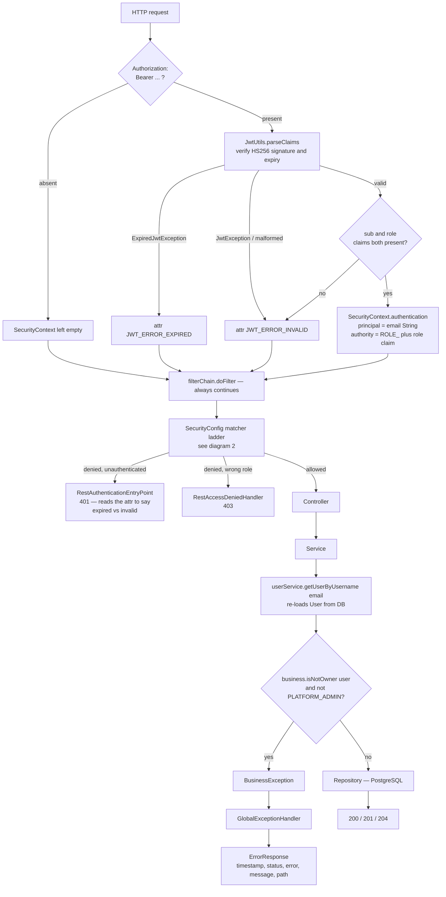
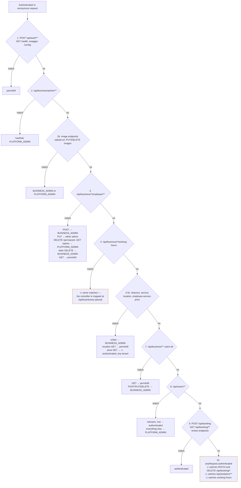
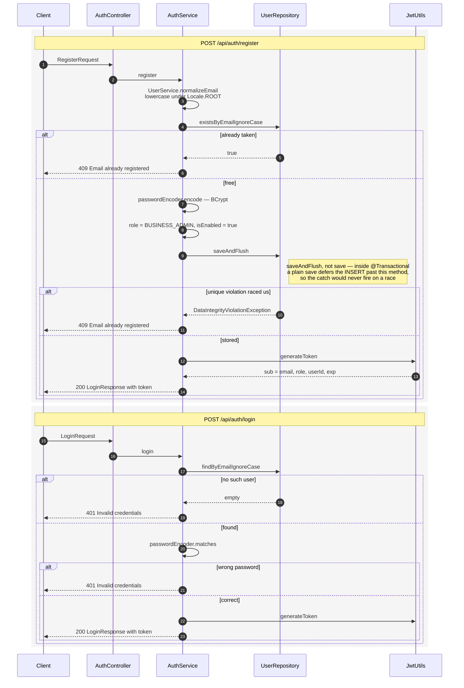
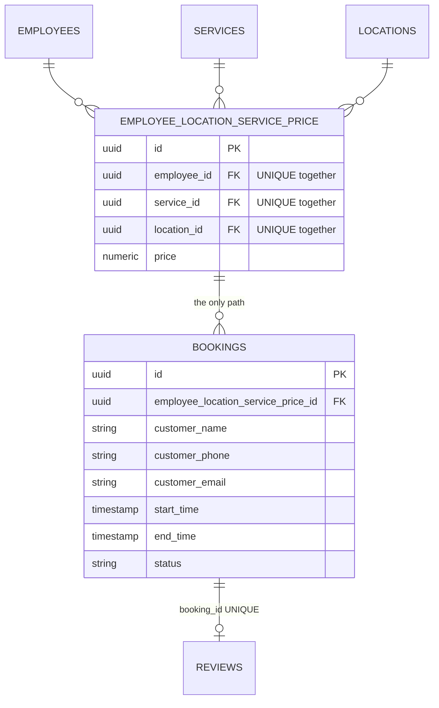
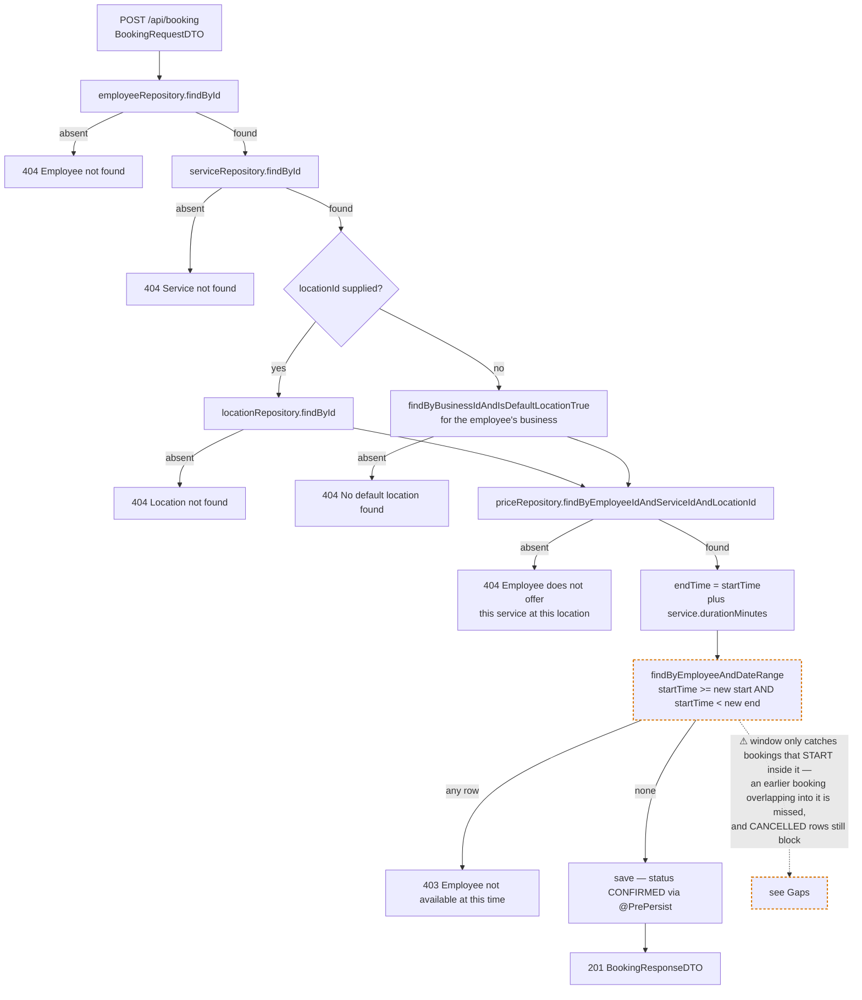
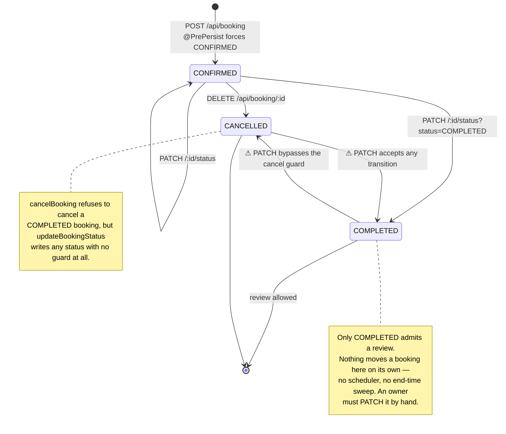
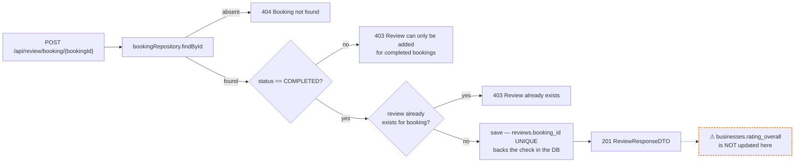
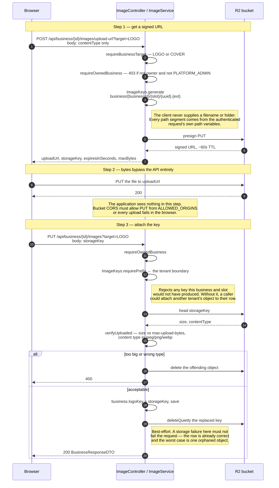
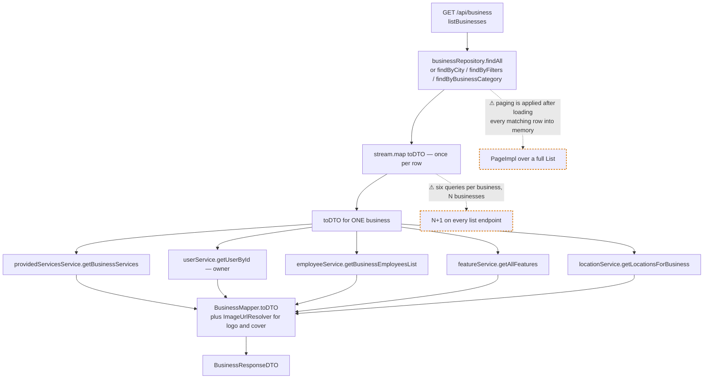

# Backend flows

Seven diagrams of how a request actually moves through this service. `CLAUDE.md` states the
rules; this states the shapes — matcher ordering, which of three upload steps carries the
tenant boundary, how a booking reaches an employee through a join row.

Every claim cites `file:line`. When a cited line moves, re-check the diagram before trusting
it. Traced against branch `dev`.

Where the drawn flow and the intended flow diverge, the divergence is drawn — annotated
`⚠` on the diagram and collected in [Gaps](#gaps-where-the-drawn-flow-differs-from-the-intended-one)
at the end. This documents behaviour; it changes none.

| # | Flow | Primary source |
|---|---|---|
| 1 | [Request lifecycle](#1-request-lifecycle) | `security/JwtAuthenticationFilter.java` |
| 2 | [Authorization decision order](#2-authorization-decision-order) | `config/SecurityConfig.java` |
| 3 | [Register and login](#3-register-and-login) | `service/AuthService.java` |
| 4 | [Booking creation](#4-booking-creation) | `service/BookingService.java` |
| 5 | [Booking lifecycle and the review gate](#5-booking-lifecycle-and-the-review-gate) | `service/ReviewService.java` |
| 6 | [Presigned image upload](#6-presigned-image-upload) | `service/ImageService.java` |
| 7 | [Business aggregate read](#7-business-aggregate-read) | `service/BusinessService.java` |
|   | [Ownership enforcement map](#ownership-enforcement-map) | all services |

---

## 1. Request lifecycle

Every request crosses the same four stages. The filter is the only place a token is read,
and the principal it installs is the user's **email string** — not a `UserDetails`, because
there is no `UserDetailsService` in this application. That is why services re-load the `User`
from the database rather than casting the principal.

The filter never fails a request itself — it always calls `doFilter` and lets the matcher
ladder decide (`JwtAuthenticationFilter.java:32-60`). An expired token and a junk token are
recorded as different request attributes (`:48`, `:56`) purely so the entry point can tell
the frontend which one happened, letting it silently re-login instead of showing an error.

**Exception → status**, all central in `exception/GlobalExceptionHandler.java`:

| Thrown | Status | Note |
|---|---|---|
| `ResourceNotFoundException`, `UserNotFoundException`, `ServiceNotFoundException` | 404 | |
| `NoResourceFoundException` | 404 | Without this, every scanner hitting a stray URL becomes a 500 with a stack trace |
| `InvalidCredentialsException` | 401 | Message is a constant, never `ex.getMessage()` |
| `AuthenticationException` | 401 | Signed token whose user no longer exists |
| `BusinessException`, `BusinessOwnershipException`, `UserNotEnabledException` | 403 | |
| `AccessDeniedException` | 403 | Required — a `@PreAuthorize` denial would otherwise race the `Exception` catch-all and 500 |
| `ConflictException`, `EmailAlreadyRegisteredException`, `BusinessFeatureAlreadyExistsException` | 409 | |
| `DataIntegrityViolationException` | 409 | JPA constraint violations, caught globally |
| `BadRequestException`, `MethodArgumentNotValidException`, type mismatch, unreadable body | 400 | |
| `StorageException` | 502 | Upstream R2 failure is not an application bug |
| anything else | 500 | Only path that logs at ERROR |

4xx logs at WARN, never ERROR — a 401 is attacker-triggerable and must not be able to fill
the log.

---

## 2. Authorization decision order

`SecurityConfig` is a first-match-wins ladder, and the ordering is load-bearing in a way the
source cannot show. Rules are evaluated top to bottom; the first matching rule decides, and
every later rule for that path is dead.

Two orderings are deliberate and must not be resorted:

- **§2b before §3** (`SecurityConfig.java:64-73`). The employee rules in §3 and the §7
  catch-all would otherwise lock `PLATFORM_ADMIN` out of the image endpoints.
- **`/permanent` and `/admin` before the general employee rules** (`:81-82`). Reversed, the
  broad `DELETE /api/business/*/employee/**` rule would grant `BUSINESS_ADMIN` the
  platform-admin-only permanent delete.

The trailing default-deny in §8 (`:128`) is also deliberate: without it, a new endpoint added
to `UserController` with no `@PreAuthorize` would fall through to §10 and be open to every
logged-in user.

Note that `permitAll` on the `GET` rules is what makes the public booking page work without
a token — business, location, employee and service reads are intentionally anonymous.

---

## 3. Register and login

Registration is self-serve and public. Both paths end at the same place: a signed JWT
carrying `role` and `userId`, with the email as subject.

The two login failure branches converge on one exception with one constant message
(`AuthService.java:60`, `:63`). Distinguishing "no such user" from "wrong password" would
turn this endpoint into a user-enumeration oracle.

`generateToken` puts `role` and `userId` in the claims and the email in `sub`
(`utils/JwtUtils.java:53-57`). `jwt.secret` has no default and must be ≥32 bytes — startup
fails otherwise (`JwtUtils.java:41-46`), so a signing key can never leak into git history as
a fallback value.

**The token is trusted for its full lifetime.** Nothing re-reads the user per request, so a
role change or a disable takes effect only at the next login, up to `JWT_EXPIRATION` later.

---

## 4. Booking creation

The shape worth knowing: since `V4__collapse_booking_employee_service_location_fks.sql`, a
`Booking` has **no** employee, service, or location foreign key. It holds exactly one
`employee_location_service_price_id`, and reaches the other three through it.

`Booking.getEmployee()`, `.getProvidedService()` and `.getLocation()` are derived accessors
that hop through `priceEntry` (`entity/Booking.java:59-69`), which is also why every
`BookingRepository` query navigates `b.priceEntry.employee...` rather than a direct join.

The price-entry lookup does double duty: it prices the booking *and* proves the employee
actually offers that service at that location, since the row only exists if someone created
it. `EmployeeLocationServicePriceService.create` validates that employee, service and
location all belong to the same business, so the combination is same-tenant by construction.

No availability endpoint exists. `utils/TimeSlotGenerator` would compute open slots but has
zero callers — the conflict check at write time is the only availability logic that runs.
Working hours are not consulted, so a 03:00 booking is accepted.

---

## 5. Booking lifecycle and the review gate

The review gate, `service/ReviewService.java:28-49`:

The explicit `findByBookingId` pre-check gives the friendly 403; the `UNIQUE` constraint on
`reviews.booking_id` is what makes it correct when two submissions race.

Replying to a review is owner-gated by walking the whole chain —
`review.booking.employee.business.owner` (`ReviewService.java:71`) — the longest ownership
traversal in the codebase.

---

## 6. Presigned image upload

Three steps across three parties. The point of the design: **no image bytes ever pass through
this application.** The browser PUTs straight to Cloudflare R2.

Employee photos mirror this exactly under
`/api/business/{id}/employee/{employeeId}/images`, with `employeePhotoPrefix` as the boundary
(`ImageService.java:104-134`). `requireOwnedEmployee` additionally scopes the employee to the
business in the path, so a valid employee id belonging to another tenant reads as 404 rather
than resolving.

Two structural consequences:

- **The size limit cannot be enforced in Java.** `storage.max-upload-bytes` is advice to the
  client plus the `verifyUploaded` backstop at step 3; the real gate is the bucket's own
  upload restrictions.
- **Orphans are never reclaimed.** A URL issued at step 1 but never attached at step 3 leaves
  an object in the bucket forever. The 60s TTL keeps the window small and keys are namespaced
  per business, but nothing sweeps them.

Columns hold the **storage key**, not a URL (renamed in `V6`). `ImageUrlResolver.toPublicUrl`
builds the URL at response time and passes anything already starting with `http` straight
through — that is how pre-V6 rows keep rendering with no backfill. Response DTO fields are
still named `logoUrl` / `coverImageUrl` / `photoUrl`, so the frontend contract never moved.

---

## 7. Business aggregate read

`BusinessService.toDTO` (`service/BusinessService.java:145-155`) is called for every business
returned by every business endpoint, and it fans out to five sub-services plus a user lookup.

`listBusinesses` and `listBusinessesByQuery` both build a `PageImpl` from a fully materialised
`List` (`BusinessService.java:96-100`, `:169-173`), so the `Pageable` slices a result set that
has already been loaded and mapped in full. This is fine at current data volume and is the
first thing to change when it stops being fine.

### Ownership enforcement map

The same predicate is written four different ways across six services. All but one also admit
`PLATFORM_ADMIN`.

| Service | Where | Form | Admits `PLATFORM_ADMIN` |
|---|---|---|---|
| `LocationService` | `:108-113` | `business.isNotOwner(user)` + role check | yes |
| `ImageService` | `:167-172` | `business.isNotOwner(user)` + role check | yes |
| `EmployeeLocationServicePriceService` | `:169-171` | `business.isNotOwner(user)` + role check | yes |
| `EmployeeService` | `:174-178` | `getOwner().getId().equals(...)` + role check | yes |
| `ProvidedServicesService` | `:141-145` | `getOwner().getId().equals(...)` + role check | yes |
| `BusinessService` | `:109-112`, `:130-133` | inline, not extracted to a helper | yes |
| `ReviewService` | `:71-73` | walks `booking.employee.business.owner` | yes |
| `FeatureService` | `:48` | bare `business.isNotOwner(user)` | **no** ⚠ |
| `BusinessWorkingHoursService` | — | **no ownership check at all** ⚠ | — |
| `BookingService` | — | **no ownership check at all**, takes no `currentUser` ⚠ | — |
| `AnalyticsService` | — | **no ownership check at all** ⚠ | — |

`LocationService.validateBusinessOwnership` is the form worth standardising on.

---

## Gaps: where the drawn flow differs from the intended one

Found while tracing. Listed newest-found first; the last two are already recorded in
`CLAUDE.md` and appear here because the diagrams make them visible.

**1. The booking conflict check misses overlaps.**
`findByEmployeeAndDateRange` (`repository/BookingRepository.java:20-25`) matches
`startTime >= :startDate AND startTime < :endDate` — bookings that *start* inside the new
window. An existing 10:00–11:00 booking is not returned when checking a new 10:30–11:30 one,
so both are accepted for the same employee. The query also does not filter on status, so a
`CANCELLED` booking still blocks its old slot. An overlap test needs
`existing.start < new.end AND existing.end > new.start` plus a status filter —
`BusinessWorkingHoursService.validateNoOverlap:147-149` already has the correct form.

**2. `/api/booking` has no ownership check anywhere.**
`BookingController` never resolves a current user and no `BookingService` method takes one.
`GET /api/booking` returns every booking on the platform. `PATCH /{id}/status` and
`DELETE /{id}` are not matched by §9 of `SecurityConfig` at all — §9 lists only `POST
/api/booking` and `GET /api/booking/**` — so they fall through to
`.anyRequest().authenticated()`. Any logged-in account of any role can read, re-status, or
cancel any business's bookings, including the customer PII on them.

**3. `updateBookingStatus` enforces no state machine.**
`BookingService.updateBookingStatus:120-128` writes whatever status it is given. This
sidesteps the `cancelBooking` guard against cancelling a `COMPLETED` booking (`:130-140`),
and lets a `CANCELLED` booking be marked `COMPLETED` and then reviewed.

**4. `/api/analytics/**` has no matcher and no ownership check.**
`AnalyticsController.getBusinessDashboard` takes a `businessId` straight from the path with no
current-user resolution, and no `SecurityConfig` rule names `/api/analytics`, so it lands on
`.anyRequest().authenticated()`. Any logged-in account reads any business's booking counts and
ratings.

**5. `businesses.rating_overall` is never recomputed.**
Written once as `0.0` in `Business.onCreate:99` and nowhere else. Yet
`BusinessRepository.findByFilters:26-29` filters discovery on it, so any `minRating` above 0
matches nothing, and `BusinessMapper` serves the stale 0.0 on every business response. Real
averages exist but only via `ReviewRepository.getAverageRatingByBusiness:20-21`, on the
separate `/api/review/business/{id}/average` endpoint. Either recompute the column when a
review lands, or drop it and always read through the query.

**6. `TimeSlotGenerator` is dead code.**
Zero callers anywhere in `src/`. `CLAUDE.md` describes it as generating available booking
slots. Its no-arg overload also hardcodes 09:00–19:00 and ignores `business_working_hours`
entirely, so it would be wrong for most businesses if it were wired up.

**7. `FeatureService.addFeature` has no `PLATFORM_ADMIN` escape hatch.**
`:48` is a bare `business.isNotOwner(user)`, unlike the seven other ownership checks. A
platform admin cannot add a feature to a business they do not own. It is also the only check
that first requires `user.isEnabled()` (`:43-44`).

**8. Working hours are unprotected.** *(already in `CLAUDE.md`)*
`BusinessWorkingHoursController` is mapped at `/api/businesses/{businessId}/working-hours`
(plural) while every `SecurityConfig` rule uses the singular `/api/business/`, so §4 is dead
and these endpoints fall through to `.anyRequest().authenticated()`. The service also has no
ownership check on create, update or delete, and the controller never resolves a current user.

**9. Cross-tenant reads on the pricing endpoints.** *(already in `CLAUDE.md`)*
`EmployeeLocationServicePriceService.getById` / `getByEmployee` / `getByEmployeeAndLocation`
take no `currentUser`, and §6c maps the GETs to `.authenticated()` — so any logged-in tenant
can read another business's pricing table. Deliberately open pending a decision on whether
prices are owner-only or public booking-page data.

---

## Keeping this current

Re-check when any of these change: `SecurityConfig` matcher ordering, `ImageService` /
`ImageKeys`, `BookingService.createBooking` or `BookingRepository`, the `Booking` ↔
`EmployeeLocationServicePrice` relationship, or `BusinessService.toDTO`'s fan-out.

Every `file:line` above was verified against branch `dev` at the time of writing.
